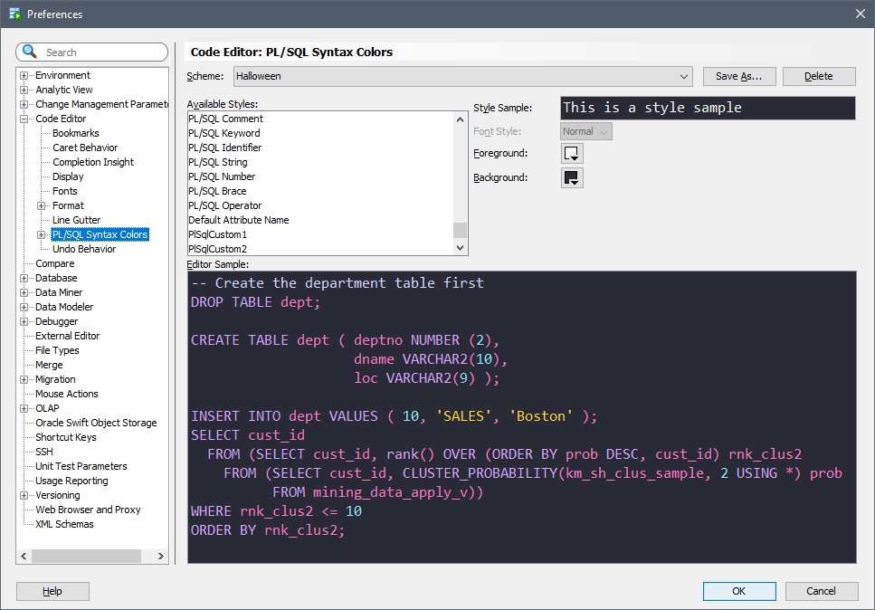

# Oracle SQLDeveloper custom color schemes
Custom color schemes for Oracle SQL Developer.

## Installation ##
> See original instructions providing by [Ozmoroz](https://github.com/ozmoroz/ozbsidian-sqldeveloper/blob/master/README.md)

- Close SQL Developer. This is important. If you modify the scheme file while SQL Developer is open, your changes won't be saved.

- Locate file `dtcache.xml` in the SQL Developer's settings directory.  
&nbsp;  
Windows:  
```%APPDATA%\SQL Developer\systemn.n.n.n.n.n\o.ide.n.n.n.n.n.n.n```  
Examples:  
```C:\Users\alonperezext\AppData\Roaming\SQL Developer\system3.2.20.09.87\o.ide.11.1.1.4.37.59.48```  
```C:\Users\alonperezext\AppData\Roaming\SQL Developer\system19.1.0.094.2042\o.ide.13.0.0.1.42.170225.201```  
&nbsp;  
Linux or Mac OS X:  
```~/.sqldeveloper/systemn.n.n.n.n.n/o.ide.n.n.n.n.n.n.n```  
Examples:  
```~/.sqldeveloper/system3.2.20.09.87/o.ide.11.1.1.4.37.59.48```  
```~/.sqldeveloper/system19.1.0.094.2042/o.ide.13.0.0.1.42.170225.201```  
&nbsp;  

- Locate `<schemeMap>` tag inside dtcache.xml file. Insert the content of the color scheme xml file inside `<schemeMap>` alongside the other colour schemes. Be careful not to break the XML.


- Launch SQL Developer. Navigate to menu Tools->Preferences, then select item Code Editor -> PL/SQL Syntax Colours in the left pane.

- Select theme in the "Scheme" drop down list on the top.


